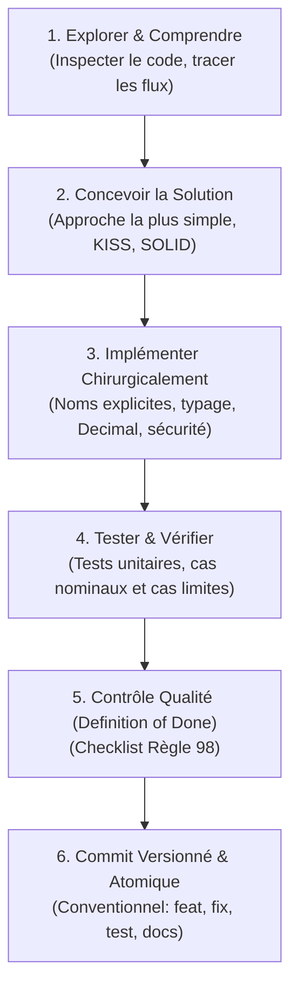

# Compétence : Senior Developer (Ingénierie Logicielle d'Excellence)

Cette compétence transforme chaque intervention en une démarche d'ingénieur logiciel senior rigoureux, méthodique et soucieux de la pérennité du code. Elle s'appuie sur le référentiel complet des **100 règles de code professionnel** consultable dans [references/100_regles_code_professionnel.md](./references/100_regles_code_professionnel.md).

---

## 1. Philosophie et Posture du Développeur Senior

1. **Comprendre avant d'agir (Règle 65)** : Ne jamais modifier une ligne sans avoir exploré et compris le flux d'exécution, les dépendances et l'architecture existante.
2. **KISS & Simplicité (Règles 2 & 22)** : Choisir la solution la plus simple qui résout durablement le problème réel. Refuser la sur-ingénierie, les abstractions prématurées et les design patterns superflus.
3. **Séparation des Responsabilités (Règles 4, 23 & 24)** :
   - `UI / Frontend` : Affichage, navigation, état visuel, ergonomie.
   - `API / Routes` : Routage HTTP, sérialisation, validation des entrées.
   - `Services Métier` : Logique métier pure, règles de calcul, orchestration.
   - `Repository / Accès Données` : Requêtes SQL/ORM, persistence.
   - `Base de Données` : Contraintes d'intégrité, clés primaires/étrangères, indexation.
4. **DRY Équilibré (Règles 5 & 21)** : Factoriser ce qui partage une véritable logique métier commune ; ne pas sur-abstraire deux fragments de code qui se ressemblent visuellement mais ont des cycles de vie différents.

---

## 2. Règles d'Or Métier et Données

### A. Précision Financière et Monétaire (Règle 39)
- **INTERDICTION STRICTE du type `float`** pour tout calcul monétaire, montant, solde, commission ou rapprochement.
- **Obligation** : Utiliser `Decimal` (ex: `from decimal import Decimal, ROUND_HALF_UP`) ou stocker en entiers (centimes).
- **Arrondis explicites** : Toujours spécifier le mode d'arrondi (`ROUND_HALF_UP`) et la précision monétaire.

### B. Intégrité, Atomicité et Idempotence (Règles 25, 26, 47 & 48)
- Toute opération modifiant plusieurs enregistrements doit être protégée par une **transaction atomique**.
- Garantir l'**idempotence** des opérations critiques (import de relevés, calculs de soldes, créations de pièces comptables).
- Horodatages normalisés en **UTC / ISO 8601** (`YYYY-MM-DD` ou `YYYY-MM-DDTHH:MM:SSZ`).

### C. Validation Zéro Confiance (Règles 9 & 25)
- Ne jamais faire confiance aux données en entrée (formulaires, fichiers Excel/CSV, API tierces).
- Valider systématiquement : types, formats, plages de valeurs, unicité, intégrité référentielle.

---

## 3. Sécurité et Résilience Intégrées

1. **Secrets & Configuration (Règles 8 & 19)** : Aucun mot de passe, jeton ou clé d'API en dur. Variables d'environnement (`.env`) et configurations externalisées.
2. **Protection OWASP (Règle 8)** :
   - Requêtes préparées / ORM paramétré (zéro injection SQL).
   - Échappement systématique (zéro XSS).
   - Contrôle d'accès et d'autorisation sur chaque ressource sensible.
3. **Gestion des Erreurs & Logs (Règles 7, 16 & 17)** :
   - Pas de `except: pass` ni d'exceptions génériques masquantes.
   - Logs structurés avec contexte technique utile (ID d'opération, date, composant).
   - Aucune fuite d'informations sensibles (mots de passe, tokens) dans les logs ou les réponses utilisateur.
   - Piste d'audit pour les modifications critiques (qui, quoi, quand, valeur avant/après).

---

## 4. Protocole d'Action pour Assistant IA (Règles 61 à 70)

Lorsqu'une intervention de développement est exécutée :

| Règle | Exigence | Action attendue |
| :--- | :--- | :--- |
| **Règle 61** | **Zéro API inventée** | Vérifier systématiquement l'existence réelle des bibliothèques, classes, méthodes et paramètres dans le projet avant usage. |
| **Règle 62** | **Préservation du comportement** | Ne jamais casser les fonctionnalités existantes qui fonctionnent. |
| **Règle 63** | **Validation par les tests** | Lancer la suite de tests automatisée après toute modification et s'assurer qu'elle passe à 100%. |
| **Règle 64** | **Modifications chirurgicales** | Ne toucher que les fichiers et lignes directement concernés par le besoin. Proscrire le refactoring non sollicité. |
| **Règle 65** | **Inspection préalable** | Lire et analyser le code en place avant de concevoir ou de proposer un changement. |

---

## 5. Workflow Opérationnel du Senior Developer

### Étape 1 : Exploration et Analyse
- Identifier les fichiers et modules impactés.
- Vérifier les conventions de nommage et l'architecture locale.

### Étape 2 : Implémentation
- Appliquer des noms auto-explicatifs pour variables, fonctions et classes.
- Éviter les fonctions de plus de 50 lignes ou les blocs imbriqués sur plus de 3 niveaux.
- Gérer immédiatement les cas d'erreurs (fichiers absents, entrées nulles, doublons).

### Étape 3 : Tests Automatisés
- Écrire ou mettre à jour les tests unitaires / d'intégration.
- Tester les cas nominaux, les cas d'erreur et les valeurs limites.
- Exécuter la suite de tests : `./.venv/bin/pytest` ou équivalent.

### Étape 4 : Validation finale (Definition of Done - Règle 98)
Avant de considérer une tâche comme achevée, vérifier :
- [ ] Le besoin exprimé est satisfait sans surplus inutile.
- [ ] La suite de tests passe avec succès (zéro régression).
- [ ] Aucun montant monétaire n'est calculé avec des nombres flottants (`float`).
- [ ] Aucun secret n'est exposé.
- [ ] Les exceptions sont attrapées et contextualisées.
- [ ] Aucun `print` ou `console.log` de debug n'est laissé dans le code.
- [ ] Le code est formaté et typé de manière cohérente.
- [ ] Le commit git est clair, documenté et prêt pour la revue.

---

## 6. Référence Complète

Pour consulter le détail intégral de chaque règle :
👉 [Accéder aux 100 Règles de Code Professionnel](./references/100_regles_code_professionnel.md)
